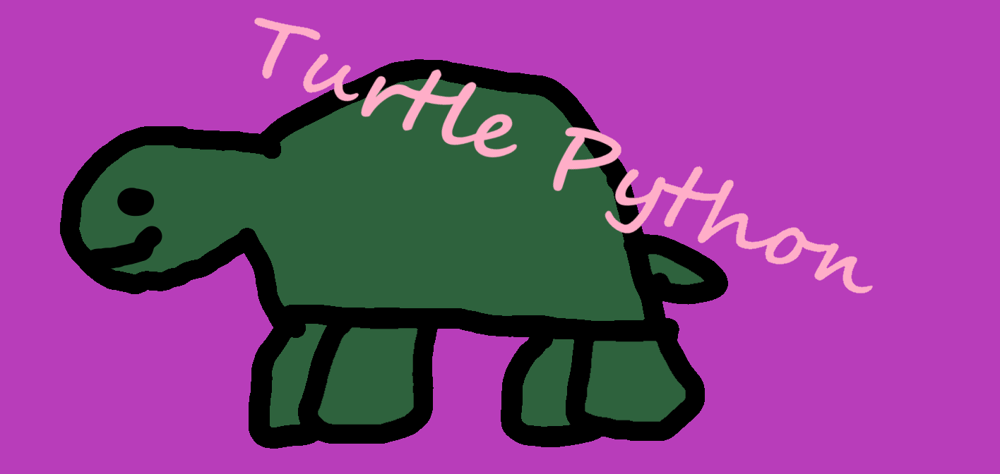

# Description

Cute project to make some drawings with Father and Daughter.

## Requirements

* Python

# How to Run

1. Make sure you have any dependencies installed.
    * Python
1. Clone the repo (or download the associated script you'd like to run).
    * e.g. `git clone https://github.com/AceofSpades5757/speedy-turtle.git`
1. Move to that directory.
    * e.g. `cd ./speedy-turtle`
1. Run the script.
    * e.g. For Windows: `py turtle_cube.py`
    * e.g. For Linux: `python3 turtle_cube.py`
    * e.g. From a file explorer: double-click on the file.

Enjoy!

# Why

Because it sounded like a fun way to get my beloved daughter interested in coding.

# Examples

